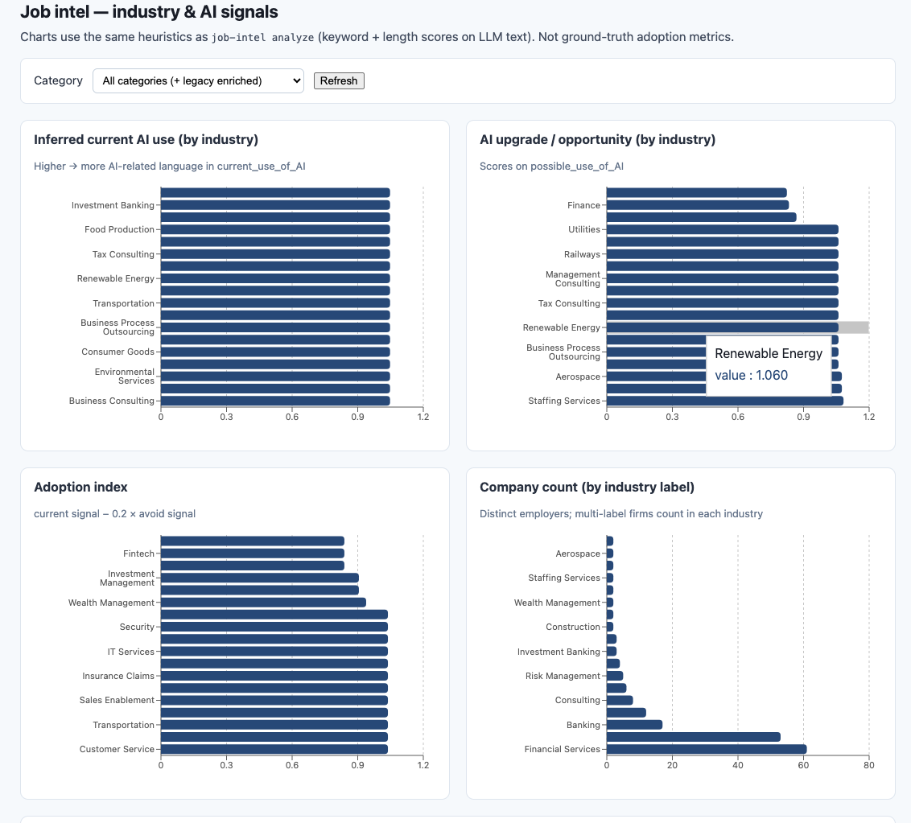

# Industry analysis

## Objective

The goal is to **scan job postings across industries** (by aggregating listings—typically one job category at a time) and infer, for each hiring organization, **where their work could be improved using AI**, **where they are likely already using AI**, and **where AI should be avoided**. Those angles are captured in structured outputs: `current_use_of_AI`, `possible_use_of_AI`, and `avoid_AI_use`, together with `Name` and `Industry`.

## Overview

This tool fetches listings from the [Adzuna](https://developer.adzuna.com/) Jobs API **for one job category** using the **category tag** you pass on the CLI (`--category`). Optionally place **`categories.json`** under `DATA_DIR` if you want to pass a **human-readable label** instead of the tag. Output lives under **`DATA_DIR/<category_tag>/`** (raw pages, checkpoint, company index, then flat LLM JSON per company: `Name`, `Industry`, `current_use_of_AI`, `possible_use_of_AI`, `avoid_AI_use`).

## Visualizing analysis

You can turn LLM insight JSON into charts and tables in **three** ways:

| Approach | When to use | Output |
|----------|-------------|--------|
| **`job-intel analyze`** | One-off reports, sharing PNGs, no Node.js | PNG + CSV under `DATA_DIR/analysis_reports/` (or `--output-dir`) |
| **Web dashboard (Vite)** | Interactive filtering, exploring categories in the browser | Charts + table at **http://127.0.0.1:5173** (dev) or **http://127.0.0.1:8000/ui/** (after `npm run build`) |
| **HTTP API** | Custom scripts or another frontend | JSON from **`GET /api/job-intel/...`** (see [Optional HTTP API](#optional-http-api)) |

Prerequisites for any visualization: you already have **`DATA_DIR/<tag>/insights/*.json`** (from **`job-intel fetch`**) or legacy **`enriched/**/*.json`**. Set **`DATA_DIR`** in `.env` so it points at that tree.

### Example: web analytics UI

The dashboard shows industry-level bars (current AI signal, upgrade opportunity, adoption index, company counts) and a scrollable sample of companies with truncated text previews.



*(Screenshot reflects a sample run; your labels and scores depend on fetched categories and LLM output.)*

## Repository layout

```text
src/industry_analysis/
  presentation/
    app.py                      # FastAPI: /health, /api/job-intel/*, optional /ui (built React)
    job_intel_routes.py         # Read-only JSON for the dashboard
    job_intel_view_settings.py  # DATA_DIR for APIs (no Adzuna keys)
  company_analysis/
    domain/
    application/
    infrastructure/
    presentation/
      cli.py                    # `job-intel` entrypoint

web/                            # Vite + React + TypeScript (Recharts)
  package.json
  src/App.tsx

docs/                           # README assets (e.g. UI screenshots)
  industry_analysis_ui.png
```

Console scripts (from `pyproject.toml`):

| Script | Module |
|--------|--------|
| `job-intel` | `industry_analysis.company_analysis.presentation.cli:main` |
| `api` | `industry_analysis.presentation.app:run` |

## Architecture (onion)

Layers are **inside → out** under `src/industry_analysis/company_analysis/`:

| Layer | Path | Role |
|-------|------|------|
| **Domain** | `company_analysis/domain/` | Entities in `models.py`; merging rules in `company_merge.py`. No imports from outer layers. |
| **Application** | `company_analysis/application/` | **Ports** (`ports.py`), **DTOs** (`dto.py`), **paths** (`paths.py`), **category catalog** (`categories_catalog.py`), **shared LLM prompt** (`company_prompt.py`), **pandas insight analytics** (`insights_analytics.py`), **orchestrators** (`fetch_orchestrator.py`, `enrich_orchestrator.py`). |
| **Infrastructure** | `company_analysis/infrastructure/` | **Adapters**: Adzuna HTTP client, local JSON blob store, retry helper, Ollama / Gemini / OpenAI LLM clients, `pydantic-settings` (`infrastructure/config/settings.py`). |
| **Presentation** | `company_analysis/presentation/cli.py` and `industry_analysis/presentation/` | CLI composition root; **FastAPI** app (`app.py`), **job-intel dashboard** routes (`job_intel_routes.py`). |

**Dependency direction:** domain ← application; infrastructure implements application ports; `company_analysis/presentation/cli.py` references inner layers for the CLI; `industry_analysis/presentation` hosts FastAPI and may import `company_analysis.application` for read-only analytics.

## Requirements

- Python **3.13+**
- [uv](https://docs.astral.sh/uv/) (recommended)

## Setup

From the repository root:

```bash
uv sync
```

Create a `.env` file in the project root (`pydantic-settings` loads it when running `job-intel`). Minimum for **fetch** (Adzuna + LLM for per-company insights) with the **default local Ollama** backend:

```env
APPLICATION_ID=your_adzuna_app_id
APPLICATION_KEY=your_adzuna_app_key
```

Run **[Ollama](https://ollama.com/)** locally (`ollama serve`), then pull a model (defaults match `OLLAMA_MODEL`, e.g. `ollama pull llama3.2`).

For **Google Gemini**, set `LLM_PROVIDER=gemini` and `GEMINI_API_KEY`. For **OpenAI**, set `LLM_PROVIDER=openai`, `OPENAI_API_KEY`, and optionally `OPENAI_BASE_URL` / `OPENAI_MODEL`.

### Environment variables

| Variable | Purpose |
|----------|---------|
| `APPLICATION_ID` | Adzuna application id (required for fetch) |
| `APPLICATION_KEY` | Adzuna application key (required for fetch) |
| `ADZUNA_COUNTRY` | Country segment in API paths (default: `gb`) |
| `ADZUNA_BASE_URL` | API **host** only (default: `https://api.adzuna.com`). Do not include `/v1/api` — the client adds `/v1/api/jobs/...`. |
| `DATA_DIR` | Root for all JSON artifacts (default: `data/job_intel`) |
| `RESULTS_PER_PAGE` | Jobs per request, max **100** (default: `100`) |
| `FETCH_CATEGORY_CONCURRENCY` | Parallel categories during fetch (default: `4`) |
| `HTTP_MAX_CONCURRENCY` | Cap on concurrent outbound HTTP calls (default: `8`) |
| `HTTP_TIMEOUT_S` | Per-request timeout in seconds (default: `60`) |
| `HTTP_MAX_RETRIES` | Retries on 429 / 5xx with backoff (default: `6`) |
| `LLM_PROVIDER` | `ollama` (**default**, local), `gemini`, or `openai` — which backend **fetch** (insights) and **enrich** use |
| `OLLAMA_BASE_URL` | Ollama HTTP root (default: `http://127.0.0.1:11434`; no path suffix) |
| `OLLAMA_MODEL` | Ollama model id (default: `llama3.2`; run `ollama pull <name>` first) |
| `OLLAMA_TIMEOUT_S` | **Read** timeout per `/api/chat` in seconds (default **300**; local inference often exceeds `HTTP_TIMEOUT_S`) |
| `GEMINI_API_KEY` | [Google AI Studio](https://aistudio.google.com/apikey) key when `LLM_PROVIDER=gemini` |
| `GEMINI_API_BASE` | Gemini REST host (default: `https://generativelanguage.googleapis.com`) |
| `GEMINI_MODEL` | Model id only, e.g. `gemini-2.0-flash` (default). Not a path — wrong values like `gemini/gemini-2.0-flash` are normalized automatically. |
| `OPENAI_API_KEY` | Bearer token when `LLM_PROVIDER=openai` |
| `OPENAI_BASE_URL` | Chat Completions base URL (default: `https://api.openai.com/v1`) |
| `OPENAI_MODEL` | Model id when using OpenAI (default: `gpt-4o-mini`) |
| `GEMINI_MIN_REQUEST_INTERVAL_S` | Seconds between Gemini calls on one client (default **1.0**); serializes traffic to reduce **429** |
| `GEMINI_MAX_RETRIES` | Retries per Gemini request on 429/5xx (default **10**) |
| `ENRICH_CONCURRENCY` | Parallel enrich tasks (default: `4`; Gemini calls also serialize per process to limit 429s) |

Generated data under `DATA_DIR` is listed in `.gitignore` (`data/job_intel/` by default).

## CLI: `job-intel`

After `uv sync`:

```bash
uv run job-intel --help
```

Equivalent module invocation:

```bash
uv run python -m industry_analysis.company_analysis.presentation.cli --help
```

Global option: `--data-dir <path>` overrides `DATA_DIR` for that run.

### `fetch`

**Requires `--category`:** the Adzuna **category tag** (e.g. `accounting-finance-jobs`), unless you maintain **`DATA_DIR/categories.json`** — then you may pass an **exact label** (case-insensitive) from that file and it will be resolved to a tag.

The CLI **does not call** Adzuna’s **`/categories`** endpoint; only **`/search`** is used for job pages.

1. Loads **`categories.json`** from disk **if present** (optional). If the file is missing or empty, `--category` is treated as the **tag** verbatim.
2. Paginates that category (up to **`RESULTS_PER_PAGE`** or **`--items-per-page`**, max 100 per request).
3. Writes under **`DATA_DIR/<category_tag>/`**:
   - `checkpoint.json` — resume cursor for this category  
   - `raw/page-00001.json` — raw Adzuna search payloads  
   - `companies_index.json` — merged unique companies from those ads  
4. After jobs are up to date for this run, writes **`insights/<company_key>.json`** per company — **only** the keys `Name`, `Industry`, `current_use_of_AI`, `possible_use_of_AI`, `avoid_AI_use` (no wrapper object). Existing insight files are skipped unless **`--force-insights`**.

`fetch` uses the same LLM configuration as **`enrich`** (`LLM_PROVIDER`, `OLLAMA_*`, `GEMINI_*`, or `OPENAI_*`).

**Structured JSON:** **Ollama** uses native **`/api/chat`** with a JSON-schema **`format`**; **Gemini** uses **`responseSchema`** + **`responseMimeType: application/json`**; **OpenAI** uses **`response_format: json_schema`** with **`strict: true`**. All paths still validate with **`CompanyEnrichment`** (Pydantic) before anything is written to disk. Use a recent Ollama release for schema-constrained **`format`**.

**Optional `categories.json` shape:**

```json
{
  "categories": [
    { "tag": "accounting-finance-jobs", "label": "Accounting & Finance Jobs" }
  ]
}
```

```bash
uv run job-intel fetch --category accounting-finance-jobs
uv run job-intel fetch --category "Accounting & Finance Jobs"
uv run job-intel fetch --category it-jobs --country gb --data-dir /path/to/output
uv run job-intel fetch --category it-jobs --pages 5 --items-per-page 50
uv run job-intel fetch --category it-jobs --force-insights
```

- **`--pages` `N`:** fetch at most **N** result pages for this category (then stop without marking the category completed). Same as legacy **`--max-pages-per-category`** (do not pass both).
- **`--items-per-page` `N`:** Adzuna **`results_per_page`** for each request (**1–100**; default comes from **`RESULTS_PER_PAGE`** in settings / `.env`).

On HTTP failure, the scoped **checkpoint** records `failed_page` and `last_error`. **Re-run the same command** (same `--category` and `DATA_DIR`) to resume.

### `status`

- Without **`--category`:** prints `categories.json` path and count, then **legacy** global checkpoint / companies paths (for older workflows).
- With **`--category`:** resolves tag/label like `fetch`, then prints scoped **`checkpoint.json`**, **`companies_index.json`** summary, and a short company sample (no Adzuna HTTP calls).

```bash
uv run job-intel status
uv run job-intel status --category accounting-finance-jobs
```

### `enrich` (legacy global index)

Reads **`derived/companies_adzuna_<country>.json`** (the old global merge path), writes **`enriched/...`** with a wrapper object (`enrichment` + `source`). The **`fetch`** command above is the primary path now (per-category folder + flat `insights/` JSON).

- **Default LLM:** local **Ollama** (`LLM_PROVIDER=ollama`, `OLLAMA_MODEL`, `ollama serve`).
- **Alternatives:** `LLM_PROVIDER=gemini` + `GEMINI_API_KEY`, or `LLM_PROVIDER=openai` + `OPENAI_API_KEY`.

```bash
uv run job-intel enrich
uv run job-intel enrich --limit 50
uv run job-intel enrich --force
uv run job-intel enrich --llm openai   # one-off override without editing .env
uv run job-intel enrich --llm gemini
```

Options: `--provider-id` (default `adzuna`), `--country`, `--limit`, `--force`, `--llm ollama|gemini|openai`.

**Enriched document shape:** top level has `enrichment` (keys `Name`, `Industry`, `current_use_of_AI`, `possible_use_of_AI`, `avoid_AI_use`) and `source` (metadata; `model` reflects the active provider’s model id).

### `analyze` (pandas + matplotlib CLI charts)

Reads all flat **`*/insights/*.json`** under `DATA_DIR` (or one **`--category`** folder), and when not scoped to a single category also loads legacy **`enriched/**/*.json`** (wrapped `enrichment` objects). Uses **pandas** for aggregation (see **[Visualizing analysis](#visualizing-analysis)**). Writes **matplotlib** PNGs and CSVs via `insight_charts.py`.

Writes to **`--output-dir`** (default **`DATA_DIR/analysis_reports/`**):

- **`industry_current_ai_usage.png`** — industries ranked by inferred *current* AI-related language  
- **`industry_ai_upgrade_opportunity.png`** — *possible* AI / improvement language  
- **`industry_ai_adoption_index.png`** — current signal with a small penalty from *avoid* language  
- **`industry_ai_upgrade_pressure.png`** — upgrade vs current baseline  
- **`industry_company_counts.png`** — how many companies map to each industry label  
- **`industry_aggregate_full.csv`** — full aggregate table  
- **`industry_top_by_current_ai.csv`** — top *N* industries by current-AI heuristic  

```bash
uv run job-intel analyze
uv run job-intel --data-dir /path/to/job_intel analyze
uv run job-intel analyze --category it-jobs --output-dir ./reports/it
uv run job-intel analyze --top-n 20
```

Note: global **`--data-dir`** must appear **before** the subcommand (`job-intel --data-dir … analyze`).

## Where data is stored

Relative to `DATA_DIR` (default `data/job_intel`):

| Path | Contents |
|------|----------|
| `categories.json` | Optional local map `{ "categories": [ { "tag", "label" }, ... ] }` for **label → tag** lookup only (never fetched from Adzuna by this app) |
| `<category_tag>/checkpoint.json` | Resume state for that category’s job pagination |
| `<category_tag>/raw/page-00001.json` | Raw Adzuna search API payload per page |
| `<category_tag>/companies_index.json` | Merged unique companies for ads seen in that category |
| `<category_tag>/insights/<company_key>.json` | Flat LLM output: `Name`, `Industry`, `current_use_of_AI`, `possible_use_of_AI`, `avoid_AI_use` |
| `analysis_reports/` (default `--output-dir` for `analyze`) | PNG charts + CSV aggregates from **`job-intel analyze`** |

Legacy (optional **`job-intel enrich`** only):

| Path | Contents |
|------|----------|
| `checkpoints/fetch_adzuna_<country>.json` | Old global fetch checkpoint |
| `derived/companies_adzuna_<country>.json` | Old global company index |
| `enriched/adzuna/<country>/<company_key>.json` | Wrapped `enrichment` + `source` |

## Optional HTTP API

```bash
uv run api
```

Health: `http://127.0.0.1:8000/health`.

**Start here in the browser:** **`http://127.0.0.1:8000/`** shows an HTML page with **exact steps** to open the charts (dev on **port 5173** or built **`/ui/`**). JSON link map: **`GET /api/info`**. Interactive API: **`/docs`**.

JSON for the React UI (same aggregates as **`job-intel analyze`**, read from `DATA_DIR` via **`JobIntelViewSettings`** — uses **`DATA_DIR`** in `.env`, no Adzuna keys required):

| Path | Description |
|------|-------------|
| `GET /api/job-intel/categories` | Category folders that contain `insights/*.json` |
| `GET /api/job-intel/aggregates?category=&top_n=` | Industry-level scores (`mean_current_ai`, `mean_ai_upgrade`, `adoption_index`, …) |
| `GET /api/job-intel/companies?category=&limit=` | Sample company rows with truncated text previews |

### Web dashboard (React + TypeScript)

See **[Visualizing analysis](#visualizing-analysis)** for how this relates to **pandas** (server) vs **Recharts** (browser). **You will not see charts on port 8000 alone.** Either run **Vite** (below) and use **http://127.0.0.1:5173**, or **`npm run build`** and open **http://127.0.0.1:8000/ui/**. Opening **http://127.0.0.1:8000/** shows instructions in the browser.

The **`web/`** app uses **Vite**, **React 18**, **TypeScript**, and **Recharts** (horizontal bar charts + company table). In development it proxies `/api` to the Python server on port **8000**.

**Prerequisites:** [Node.js](https://nodejs.org/) **20+** and npm (for `web/` only).

```bash
# Terminal 1 — API (serves JSON + optional built UI at /ui/)
uv run api

# Terminal 2 — Vite dev server (http://127.0.0.1:5173)
cd web && npm install && npm run dev
```

Set **`DATA_DIR`** in `.env` (or export it) so it points at the folder that contains your `<category_tag>/insights/` trees (same as `job-intel`).

**Production bundle:** build the SPA, then open it via FastAPI’s static mount:

```bash
cd web && npm run build
uv run api
# Open http://127.0.0.1:8000/ui/
```

`web/dist/` is gitignored; run **`npm run build`** after clone (or in CI) before relying on **`/ui/`**.

## Development

```bash
uv run ruff check src
uv run mypy src
cd web && npm run build   # Typecheck + bundle React UI (optional)
```

`mypy` is configured with the **pydantic** plugin in `pyproject.toml` so `BaseSettings` fields populated from the environment type-check correctly. Pandas/matplotlib imports used by **`job-intel analyze`** and the dashboard API are allowed via `[[tool.mypy.overrides]]` in `pyproject.toml`.

## Extending the pipeline

- **Another job provider:** match the `JobSearchProvider` protocol in `company_analysis/application/ports.py` (see `AdzunaJobSearchProvider` in `infrastructure/providers/adzuna_job_search.py`), register construction in `presentation/cli.py`.
- **Another store:** implement `BlobStore` in `application/ports.py`, add an adapter under `infrastructure/persistence/`, pass it into `FetchOrchestrator` / `EnrichOrchestrator`.
- **Another LLM backend:** implement `JsonObjectLlmPort` in `application/ports.py`, add a client under `infrastructure/llm/`, and register it in `presentation/cli.py` (`_enrich_llm_client`) alongside `OllamaJsonObjectLlm` / `GeminiJsonObjectLlm` / `OpenAiJsonObjectLlm`.
- **Dashboard charts:** extend `web/src/App.tsx` (Recharts) or add API fields in `presentation/job_intel_routes.py` / `application/insights_analytics.py`.
